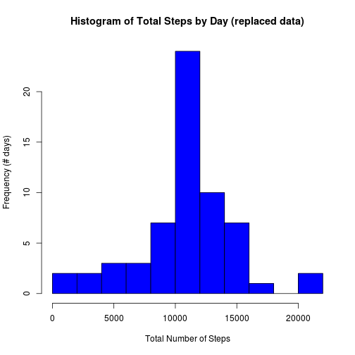
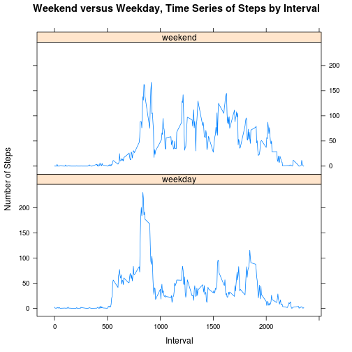

# Reproducible Research: Peer Assessment 1


## Loading and preprocessing the data

```r
library(plyr)
library(lattice)
# reads in the file and subsets to the requested dates
data <- read.csv("activity.csv")
# Data Processing Steps
```


## What is mean total number of steps taken per day?

```r
## What is mean total number of steps taken Ignore missing values
datasub <- !is.na(data$steps)
data2 <- data[datasub, ]

# Make a histogram of total number of steps taken each day Calculating the
# average steps by day
d <- ddply(data2, .(date), summarize, walk = sum(steps))

hist(d$walk, col = "red", main = "Histogram of Total Steps by Day", xlab = "Total Number of Steps", 
    ylab = "Frequency (# days)", breaks = 15)
```

 

```r

# Calculate mean and median
removedmean <- mean(d$walk)
removedmedian <- median(d$walk)
```


The mean for the data not including the missing values is 1.0766 &times; 10<sup>4</sup>. 

The median for the data not including the missing values is 10765.

## What is the average daily activity pattern?

```r
## What is the average daily activity pattern Time series plot of 5 minute
## interval and average number of steps
e <- ddply(data2, .(interval), summarize, steps = mean(steps))
plot(e, type = "l", main = "Time Series Plot of Average Steps", xlab = "Interval (min)", 
    ylab = "Average (steps)")
```

 

```r
# Which 5 minute interval, on average accross all days in the data set
# contains the maximum number of steps?
emaxinterval <- e[which.max(e[, 2]), 1]
```

Interval 835 has the maximum number of steps averaged accross all days.

## Imputing missing values

```r
## Imputing missing values Calculate and report the total number of missing
## values in dataset
missingvalues <- sum(!datasub)
```

There are 2304 missing values in the original dataset.


```r
# Devise a stratagy for filling in all of the missing values in the data
# set.
missingtable <- table(data2$date)
```

The data is missing in full days. 

Method of replacing the missing data:
NA values replaced with steps averaged over intervals matching intervals.


```r

# Create a new dataset that is equal to the original dataset but with the
# missing data filled in. Using a method of replacing the missing data from
# the average daily steps.
data$date <- strptime(data$date[], format = "%Y-%m-%d")
data3 <- data

for (i in 1:length(data3$steps)) {
    if (is.na(data3$steps[i])) 
        data3$steps[i] <- e$steps[which(e$interval == data3$interval[i])]
}

d2 <- ddply(data3, .(date), summarize, walk = sum(steps))
hist(d2$walk, col = "blue", main = "Histogram of Total Steps by Day (replaced data)", 
    xlab = "Total Number of Steps", ylab = "Frequency (# days)", , breaks = 15)
```

 

```r

# Calculate mean and median
newmean <- mean(d2$walk)
newmedian <- median(d2$walk)
```

The mean for the data with replaced values is 1.0766 &times; 10<sup>4</sup>.

The median for the data with replaced values is 1.0766 &times; 10<sup>4</sup>.

## Are there differences in activity patterns between weekdays and weekends?

```r
weekpart <- (weekdays(data3$date) == "Sunday" | weekdays(data3$date) == "Saturday")
data3$weekpart[weekpart] <- "weekend"
data3$weekpart[!weekpart] <- "weekday"

f <- ddply(data3, .(interval, weekpart), summarize, steps = mean(steps))

xyplot(f$steps ~ f$interval | f$weekpart, type = "l", layout = c(1, 2), main = "Weekend versus Weekday, Time Series of Steps by Interval", 
    xlab = "Interval", ylab = "Number of Steps")
```

 


 
  
 
  
 
  
 
 
  
  
 
